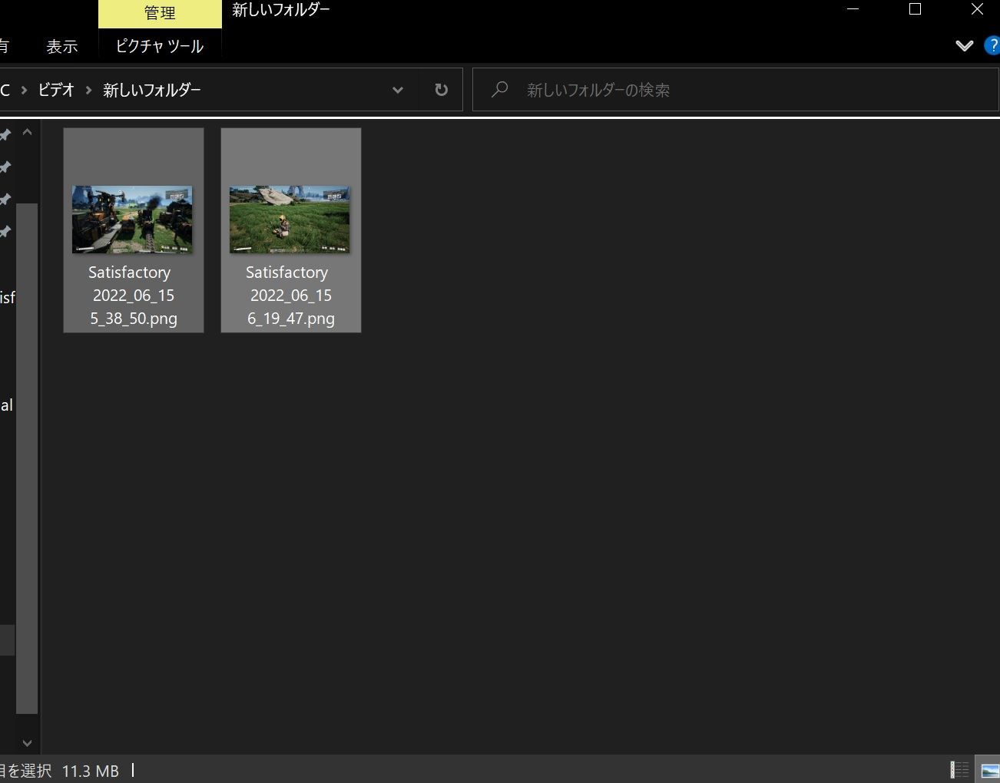
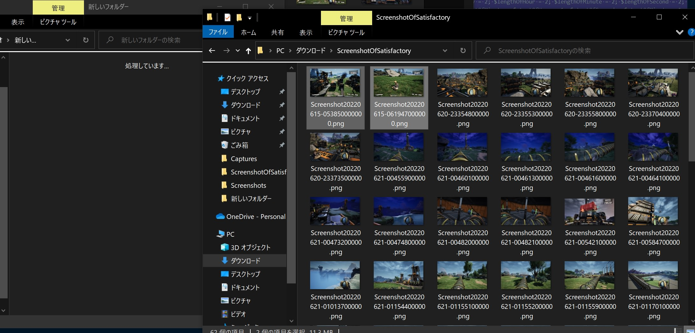

# MoveFilesPng

Moves files to other folder.

In addition, `20220617_MoveFilesWithPngquant.bat` compresses images and move those compressed files to temporary folder.

I always use `20220617_MoveFiles.bat` only.

Execute these commands anywhere.

# Table of Content

- [MoveFilesPng](#movefilespng)
- [Table of Content](#table-of-content)
- [Usage](#usage)
  - [`20220617_MoveFiles,bat`](#20220617_movefilesbat)
  - [`20220622_RenameFilesToMove.bat`](#20220622_renamefilestomovebat)
- [Dependencies](#dependencies)
- [Caution](#caution)

# Usage

## `20220617_MoveFiles,bat`

Moves files in the `srcFolder` to `destFolder`.

## `20220622_RenameFilesToMove.bat`

Before Executing Batchfile.

After Executing Batchfile.

# Dependencies

- [pngquant](https://pngquant.org) (source repo is [here](https://github.com/kornelski/pngquant).)

# Caution

`pngquantum` compresses `.png` image with lighter color than source image.

So, I don't use `20220617_MoveFilesWithPngquant.bat`.
